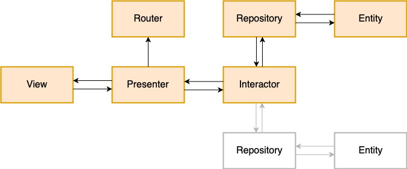

# PokemonVIPER

## Android VIPER Architecture Example 

This repository contains a  sample  app that implements VIPER architecture in Kotlin.

## VIPER Module Diagram 

Structure of VIPER module

## Dependencies
The sample app is using next libraries and frameworks:
- [DaggerHilt](https://dagger.dev/hilt/)
- [coroutines](https://kotlinlang.org/docs/coroutines-overview.html#sample-projects)
- [Retrofit](https://square.github.io/retrofit/)
- [OkHttp](https://square.github.io/okhttp/)
- [Flow](https://developer.android.com/kotlin/flow)

## Author
#### Mahmoud Diaa
Android developer 
